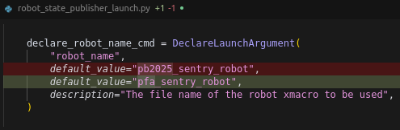
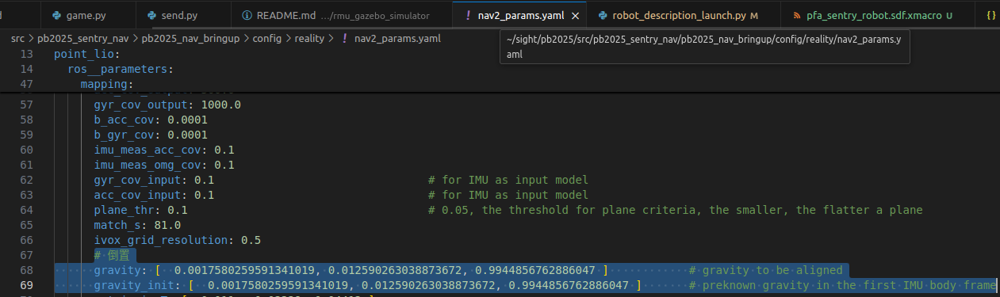
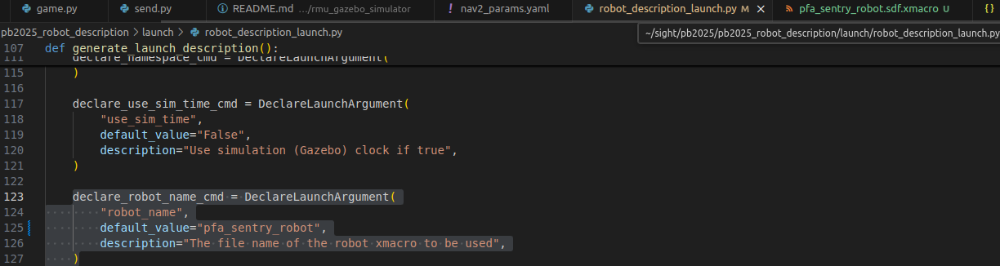
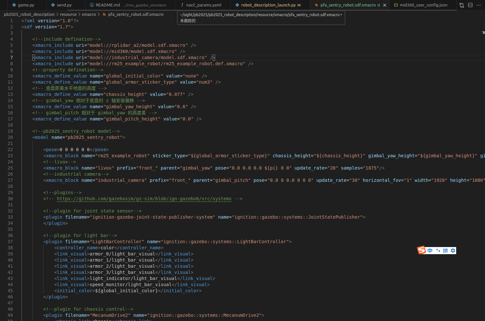
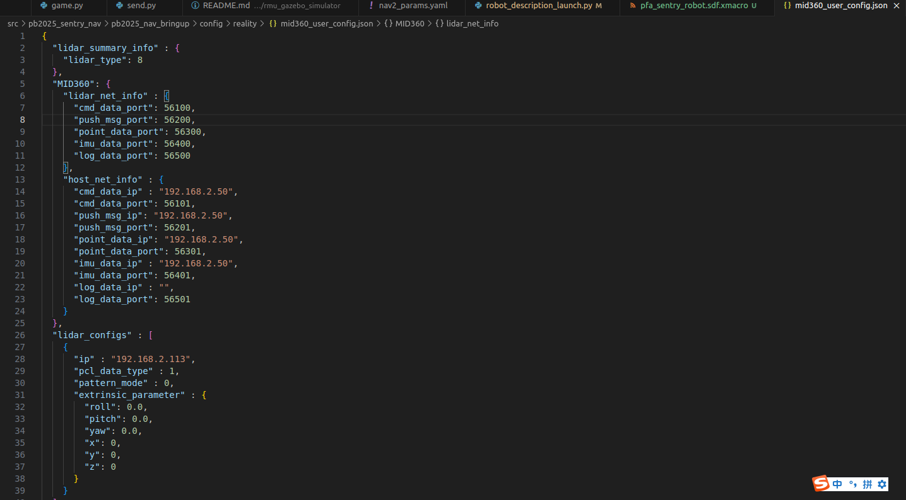

 # 整体框架使用北极熊导航！派大星恩情还不完！

编译 colcon build --symlink-install --parallel-workers 2 --cmake-args -DCMAKE_BUILD_TYPE=Release

rosdep install -r --from-paths src --ignore-src --rosdistro $ROS_DISTRO -y \
export LD_LIBRARY_PATH=/usr/lib/x86_64-linux-gnu:$LD_LIBRARY_PATH \

cd small_gicp \
mkdir build && cd build \
cmake .. -DCMAKE_BUILD_TYPE=Release && make -j \
sudo make install

sudo apt install -y libeigen3-dev libomp-dev \
sudo pip install vcstool2 \
pip install xmacro \
sudo apt install git-lfs \
pip install jinja2 typeguard

git clone https://github.com/SMBU-PolarBear-Robotics-Team/rmu_gazebo_simulator.git src/  rmu_gazebo_simulator \
vcs import src < src/rmu_gazebo_simulator/dependencies.repos \
rosdep install -r --from-paths src --ignore-src --rosdistro $ROS_DISTRO -y \

ros2 launch rmu_gazebo_simulator bringup_sim.launch.py 
#### 仿真

导航模式：

    ros2 launch pb2025_nav_bringup rm_navigation_simulation_launch.py 
    world:=rmuc_2025 
    slam:=False

建图模式：

    ros2 launch pb2025_nav_bringup rm_navigation_simulation_launch.py 
    slam:=True 

    ros2 run rmoss_gz_base test_chassis_cmd.py --ros-args -r __ns:=/red_standard_robot1/robot_base -p v:=5.0 -p w:=0.3

    ros2 run nav2_map_server map_saver_cli -f <YOUR_MAP_NAME> --ros-args -r __ns:=/red_standard_robot1

####  实车

建图模式：

```bash
ros2 launch pb2025_nav_bringup rm_navigation_reality_launch.py \
slam:=True \
use_robot_state_pub:=True
```

保存栅格地图：`ros2 run nav2_map_server map_saver_cli -f game  --ros-args -r __ns:=/red_standard_robot1`


导航模块将发布静态的机器人关节位姿数据以维护 TF 树。

在 RViz 中可视化机器人

    ros2 launch pb2025_robot_description robot_description_launch.py 
    ros2 launch pb2025_robot_description robot_description_launch.py robot_name:=pfa_sentry_robot


sudo apt install ros-humble-joint-state-publisher

sudo apt update \
sudo apt install libopencv-dev python3-pytest cmake libgoogle-glog-dev libapr1-dev \ libignition-transport11-dev libeigen3-dev


解决与 Gazebo 和 Ignition 相关的包安装问题

    libignition-transport11:
    删除现有的 Gazebo 软件源列表文件和密钥文件：
    sudo rm -f /etc/apt/sources.list.d/gazebo-stable.list
    sudo rm -f /etc/apt/keyrings/gazebo.gpg
    sudo rm -f /usr/share/keyrings/gazebo-archive-keyring.gpg
    创建 keyrings 目录：
    sudo mkdir -p /usr/share/keyrings
    下载并安装 Gazebo 的 GPG 密钥：
    curl -fsSL https://packages.osrfoundation.org/gazebo.key | sudo gpg --dearmor -o /usr/share/keyrings/gazebo-archive-keyring.gpg
    配置 Gazebo 官方软件源：
    echo "deb [arch=amd64 signed-by=/usr/share/keyrings/gazebo-archive-keyring.gpg] https://packages.osrfoundation.org/gazebo/ubuntu jammy main" | sudo tee /etc/apt/sources.list.d/gazebo-stable.list > /dev/null
    更新包列表：
    sudo apt update
    安装 Gazebo 和 Ignition 相关软件包：
    sudo apt install ros-humble-ros-gz-bridge ros-humble-ros-gz-sim libignition-transport11-dev -y

ignition-gazebo6:

    sudo apt install libignition-gazebo6-dev

colcon build检查目录

    pb2025_nav_bringup/config/reality/mid360_user_config.json


[component_container_isolated-2] Possible reasons are listed at http://wiki.ros.org/tf/Errors%20explained
[component_container_isolated-2]          at line 294 in ./src/buffer_core.cpp
[component_container_isolated-2] Warning: TF_OLD_DATA ignoring data from the past for frame gimbal_yaw_fake at time 650.496000 according to authority Authority undetectable
[component_container_isolated-2] Possible reasons are listed at http://wiki.ros.org/tf/Errors%20explained
[component_container_isolated-2]          at line 294 in ./src/buffer_core.cpp
[component_container_isolated-2] Warning: TF_OLD_DATA ignoring data from the past for frame gimbal_yaw_fake at time 650.496000 according to authority Authority undetectable
[component_container_isolated-2] Pos

point_lio 的 libusb 版本冲突导致 node 起不来 

    LD_PRELOAD=/lib/x86_64-linux-gnu/libusb-1.0.so.0 ros2 launch point_lio point_lio.launch.py

    只给某个 ROS 2 工作区或者项目用 
    如果你不想污染系统全局，可以在你的 install/setup.bash 里或者自己的
    install/local_setup.bash 最后加一句：
    export LD_PRELOAD=/lib/x86_64-linux-gnu/libusb-1.0.so.0 
    这样 source install/setup.bash 后的环境就自动带 preload。


/src/pb2025_nav_bringup/config/reality/nav2_params.yaml 

    gravity, gravity_init 
    命令启动 ros2 launch livox_ros_driver2 msg_MID360_launch.py，新开一个终端使用 ros2 topic echo livox/imu 查看实时 IMU 数据，根据 IMU 线加速度值写入 gravity 和 gravity_init，注意重力方向加负号。


还要改的几个地方





编译卡死（用两个核编译）

    colcon build --symlink-install --parallel-workers 2 --cmake-args -DCMAKE_BUILD_TYPE=Release

    fatal error: serial_driver/serial_driver.hpp: 没有那个文件或目录
    sudo apt update
    sudo apt install ros-humble-serial-driver

msg_MID360_launch.py跑不通 

    cd livox_lidar_sdk 目录 
    mkdir build && cd build 
    cmake .. 
    make -j4 
    sudo make install 
    这步会把 liblivox_lidar_sdk_shared.so 装到 /usr/local/lib/ 下。 
    确认一下： 
    ls /usr/local/lib | grep liblivox_lidar_sdk_shared.so 
    如果有，说明 OK。
    然后更新动态库缓存：
    sudo ldconfig
    然后再跑 launch：
    ros2 launch livox_ros_driver2 msg_MID360_launch.py
    应该就能跑了。

GIMP 精修栅格地图（可选）

    安装 GIMP，详细步骤请参考 https://www.gimp.org/ 官网。

    使用 GIMP 中的橡皮擦工具擦除不需要的区域。您还可以使用画笔工具为地图添加围挡等元素。完成后，将地图保存为 .pgm 格式。


sh脚本使用：

    chmod +x save.sh build.sh nav.sh 
    colcon build --symlink-install --cmake-args -DCMAKE_BUILD_TYPE=Release 

    ros2 launch rmu_gazebo_simulator bringup_sim.launch.py 

    ros2 launch pb2025_nav_bringup rm_navigation_simulation_launch.py  world:=rmuc_2025 slam:=False


航点设置 

    git clone https://github.com/6-robot/wp_map_tools.git 
    wp_map_tools/scripts$ ./install_for_humble.sh 
    source install/setup.bash 
    进下面launch文件改目录 
        实车：
            ros2 launch wp_map_tools add_waypoint_reality.launch.py （改launch下的add_waypoint_reality.launch.py）
        仿真：
            ros2 launch wp_map_tools add_waypoint_simulation.launch.py
            记得改game.py里的self.nav_ac = ActionClient(self, NavigateToPose, '/red_standard_robot1/navigate_to_pose')
        
    保存航点
    source install/setup.bash   
    ros2 run wp_map_tools wp_saver (改目录 src/wp_saver.cpp)

实车导航

    python3 game.py --home 1 --guard 4 --order 1 3 5  # 指定几个点循环执行，以及家和巡逻点
    python3 game.py --home 1 --guard 1 --order 1 2 3 --force_loop #强制循环模式
    python3 send.py  # 单纯发送vx,vy
    串口格式：
    S{x_sign}{x_vel:03d}{y_sign}{y_vel:03d}{status_flag}E

LIO 调参指南（整理自各个 Issue）

    室内可以把 filter_size_surf, filter_size_map 调小一点，一般分别为 0.05, 0.15. 对于 ouster 或者这种点特别多的，point_filter_num 可以调大，比如 5~10.
    当点云较密集时，用较大的 lidar_meas_cov。结构较单一时，用较大的 lidar_meas_cov 。


录制bag：
    
    查看话题：ros2 topic list
如果你希望将 bag 文件存储到特定目录，可以指定路径：
    
    ros2 bag record /livox/lidar /livox/imu -o ~/sight/pfa-nav/bag
停止录制：
当你想停止录制时，按 Ctrl + C 停止命令。

📖 播放录制的 Livox 数据
播放录制的 Bag 文件：
如果你录制了一个 bag 文件并希望回放，可以使用 ros2 bag play 命令：

实车

    ros2 bag play ~/sight/pfa-nav/bag
仿真
    
    ros2 bag record /red_standard_robot1/livox/lidar /red_standard_robot1/livox/imu /red_standard_robot1/tf /red_standard_robot1/tf_static -o ~/sight/pfa-nav/bag

    ros2 bag record /red_standard_robot1/livox/lidar /red_standard_robot1/livox/imu -o ~/sight/pfa-nav/bag

这会将录制的数据回放到 ROS 2 系统中，其他节点可以订阅 livox/lidar 和 livox/imu 话题。

ros2 bag play bag

在新的终端中发布静态TF变换
ros2 run tf2_ros static_transform_publisher 0 0 0 0 0 0 map front_mid360

选择性播放：
如果你只想回放特定的 topic，例如只回放 livox/imu：
ros2 bag play /path/to/save/directory/livox_data --topic /livox/imu

调节播放速率：
你还可以通过 --rate 参数来调整回放速率：
ros2 bag play /path/to/save/directory/livox_data --rate 1.5
这将以 1.5 倍的速率播放数据。


 # 测试bag：
 ros2 launch pb2025_nav_bringup rm_navigation_simulation_launch.py world:=game slam:=False use_sim_time:=True

ros2 bag play bag/bag_0.db3 --clock  


遇到这种情况，去进程找gazebo-server残留kill -9 进程号。再试一次就可以。

本项目引入 namespace 的设计，与 ROS 相关的 node, topic, action 等都加入了 namespace 前缀。如需查看 tf tree，请使用命令: 
ros2 run rqt_tf_tree rqt_tf_tree --ros-args -r /tf:=tf -r /tf_static:=tf_static -r __ns:=/red_standard_robot1

# pfa-nav

